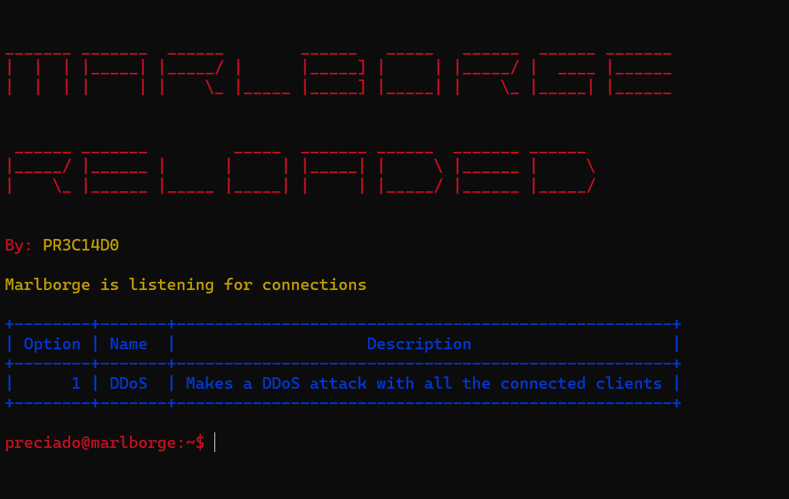

# Marlborge Reloaded
- Made for educational purposes only.
- Botnet made based at the system of <a href="http://github.com/PR3C14D0/Marlborge">Marlborge Botnet</a>.

# Gallery

# Setup
**Requirements**
- Install <a href="https://visualstudio.microsoft.com/">Visual Studio</a>.
- The libraries that appear included in the source code of the server and client.
- The source code of the project.

**Client setup**
- Open the `.sln` file of `Marlborge Client`.
- Edit the `IP` and `PORT`.
- Compile the client.

**Server setup**
- Open the `.sln` file of `Marlborge Server`.
- Edit the `LHOST` and the `LPORT`.
- Compile the server for your operative system and run!

# Finally
- Have fun!